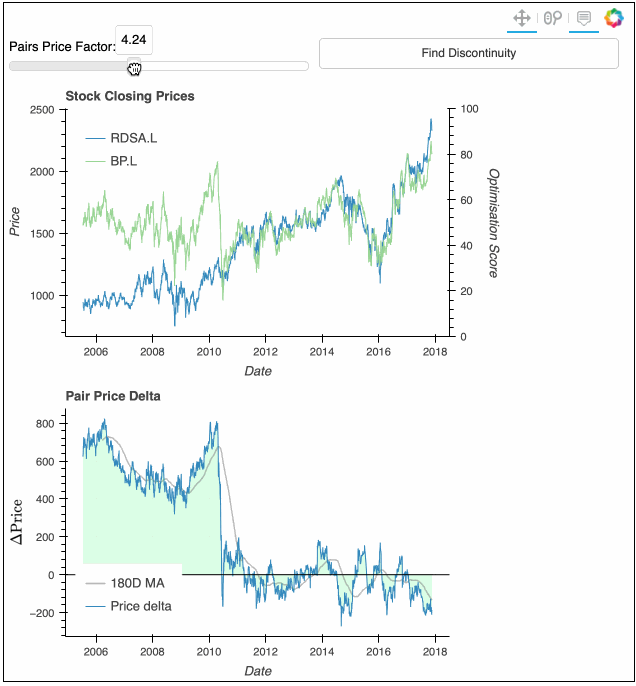
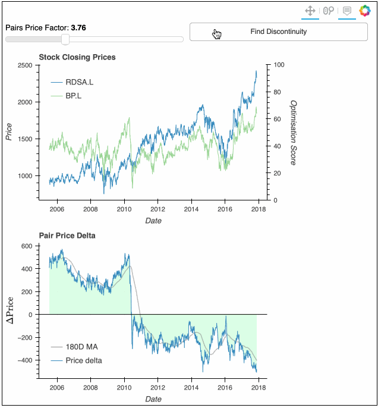
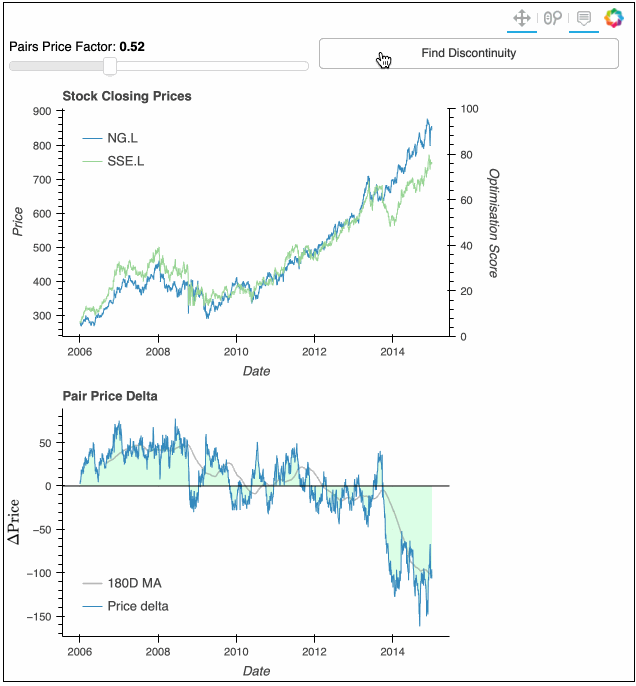

# Pairs Analytics

### Important Note
This project is both a proof of concept and a work in progress.

I make no representation about the suitability of the information or data generated or described by the code for any purpose.
It is provided "as is" without express or implied warranty.
<b>
Put simply, any output or insight generated by this code, or any code derived from this code, should not be relied upon for 
making any investment decision.
</b>

### Overview
This project contains a web app for identifying pairs trading opportunities.
Specifically, this is a Flask app with an embedded Bokeh app.

The project is initialised to run on the pair Shell and BP.
This can be modified by updating the `tickers` variable in the `bkapp(...)` function of pairs_analytics.py.

### Strategy
Pairs trading seeks to find a (dollar neutral) portfolio of securities whose overall time series is stationary.
Mean reversion of the series is then exploited to capture alpha.

One key challenge of identifying pairs trading opportunities is the fact that company fundamentals are subject to 
long and short term shifts.
Short term shifts, 
that is to say single economic events with lasting impact on the fundamentals of one of the pair's companies,
may be reflected by discontinuities in the combined time series.
The code seeks to identify high likelihood shifts in the time series, and adjust the combined times series
for these in order to aid the identification of pair formation potential.

The code achieves this by performing a brute force grid search through potential splitting time points.
At each grid point:
1. the time series is split;
2. the pairs portfolio weights are reoptimised for each of the partitioned time series;
3. the time point at which the optimal overall fit of the two resulting time series to the left and to the right of the split point is
found.

This splitting procedure therefore introduces a degree of freedom into the time series construction
which represents a possible change in the relative strengths of the company fundamentals.

(Formal equations of the portfolio construction and search to be documented here).

### Installation
The code requires the packages detailed in `requirements.txt` to be installed,
e.g. by calling in a virtual environment console,
```
$ pip install -r requirements.txt
```

### Usage
#### Running the app
The app can then be ran by calling the following at the command line:
```
$ python pairs_analytics.py
```

Following this, the app will run on [http://127.0.0.1:8000](http://127.0.0.1:8000), which can be accessed via a web browser.

#### Using the app
In the app, the pairs factor slider can be adjusted to visualise the pairs price series 
calculated using a specific price factor value.
* The weighted stock price series is given by the left hand <i>y</i>-axis in the upper plot.
* The portfolio spread is shown in the lower plot.

For an example pair portfolio consisting of Shell and BP:


The "Find Discontinuity" button can be used to isolate discontinuities. 
On clicking this button, the splitting procedure is started.
On finishing,
* A black line is displayed in the upper plot that shows the result of the optimisation, with the
optimisation penalty score shown on the right hand <i>y</i>-axis;
* A red vertical line is displayed in the upper plot that shows the optimal split time point.

For an example pair portfolio consisting of Shell and BP:


For an example pair portfolio consisting of National Grid and SSE:


### Code Limitations
* The brute force search grid is granular, and the optimisation would benefit from a local search to 
  refine the final split time point;
* The search will only identify (short term) discontinuities and not long term shifts.
  For example, the code is not able to isolate relative weakening of one component company 
  over a multi-month period that eventually ceases.